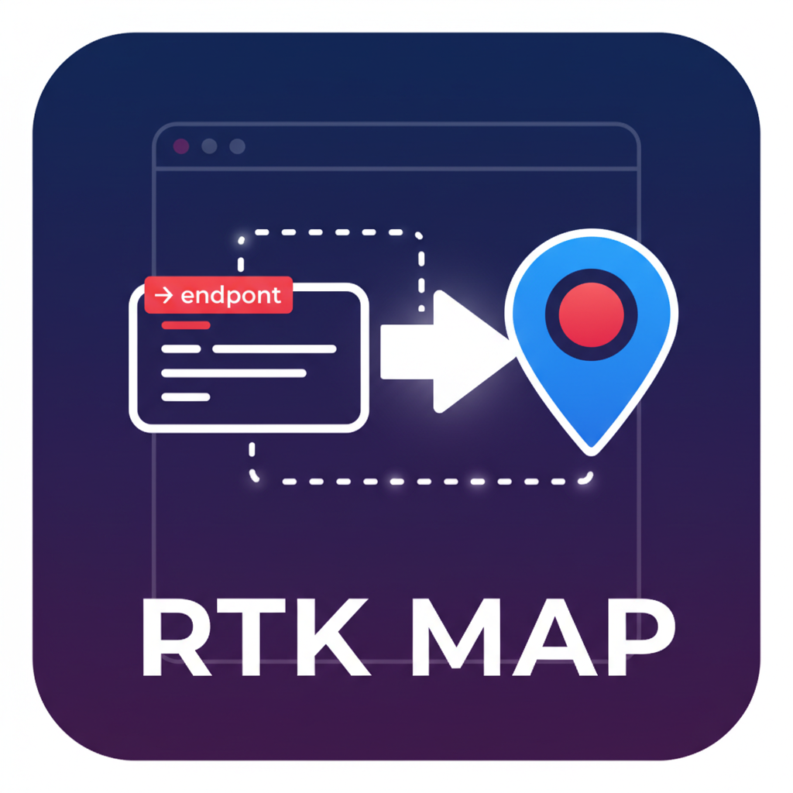
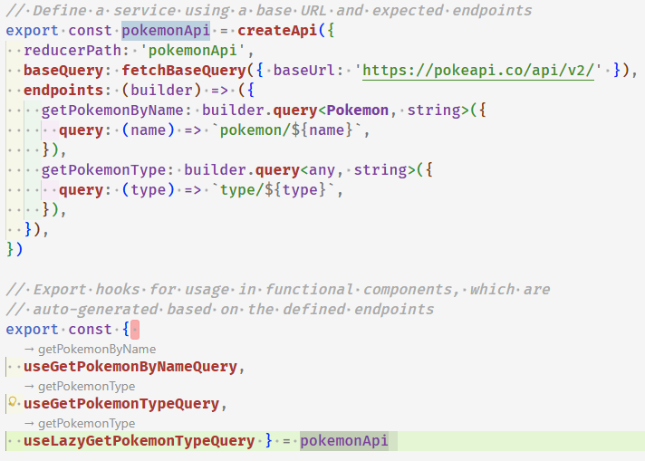
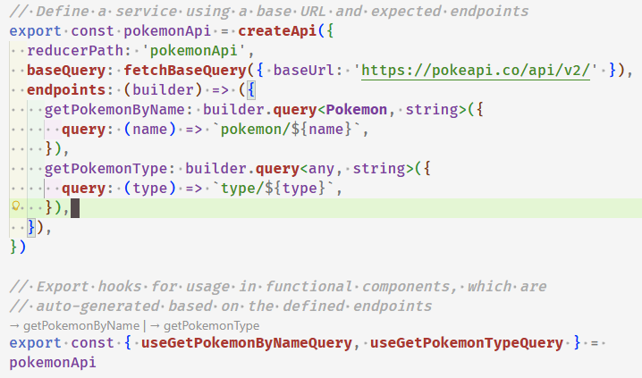

# RTK Map Hook Navigator

<p align="center">
  
</p>

<p align="center">
  <a href="https://marketplace.visualstudio.com/"></a>
  <a href="https://www.typescriptlang.org/"></a>
  <a href="https://redux-toolkit.js.org/rtk-query/overview"></a>
  <a href="https://opensource.org/licenses/MIT"></a>
</p>

A VSCode extension that provides intelligent navigation from Redux Toolkit Query (RTK Query) auto-generated hooks directly to their endpoint definitions using both CodeLens annotations and "Go to Definition" functionality.

## 🎯 Overview

When working with RTK Query, hooks are automatically generated from endpoint definitions. This extension bridges the gap by providing two navigation methods:

1. **CodeLens Annotations**: Clickable annotations above hook names showing `→ endpointName`
2. **Go to Definition**: Standard VSCode navigation (F12, Ctrl+Click) from hooks to endpoints

## ✨ Features

- **Smart CodeLens Detection**: Automatically detects RTK Query hook destructuring patterns and adds clickable annotations
- **Go to Definition Support**: Navigate from exported hooks to their endpoint definitions with F12 or Ctrl+Click
- **Multiple Format Support**: Handles all common RTK Query export patterns (single-line, multi-line)
- **TypeScript Support**: Works seamlessly with TypeScript files
- **Zero Configuration**: Works out of the box with standard RTK Query patterns
- **Pattern Recognition**: Supports `useXxxQuery`, `useXxxMutation`, and `useLazyXxxQuery` formats

## 🔍 How It Works

The extension analyzes your TypeScript files and provides two navigation methods:

### CodeLens Navigation
Adds clickable CodeLens annotations above RTK Query hook names. Each annotation shows `→ endpointName` and clicking it navigates to the corresponding `builder.query` or `builder.mutation` definition.

### Go to Definition Navigation
Implements VSCode's DefinitionProvider to enable standard "Go to Definition" functionality for RTK Query hooks, allowing Ctrl+Click or F12 navigation.

### Hook Name Parsing

The extension intelligently converts hook names to endpoint names:

| Hook Name | Endpoint Name |
|-----------|---------------|
| `useGetPokemonByNameQuery` | `getPokemonByName` |
| `useCreateUserMutation` | `createUser` |
| `useLazyFetchPostsQuery` | `fetchPosts` |

## 📋 Supported Patterns

### 1. Single-Line Destructuring
```typescript
// CodeLens: → getPokemonByName
export const { useGetPokemonByNameQuery } = pokemonApi
```


### 2. Multi-Line Destructuring (Closing Brace on Separate Line)
```typescript
export const {
  // CodeLens: → getPokemonByName
  useGetPokemonByNameQuery,
  // CodeLens: → createUser
  useCreateUserMutation,
  // CodeLens: → fetchPosts
  useLazyFetchPostsQuery
} = api
```



### 3. Multi-Line Destructuring (Closing Brace on Same Line)
```typescript
export const {
  // CodeLens: → getPokemonByName
  useGetPokemonByNameQuery,
  // CodeLens: → createUser
  useCreateUserMutation,
  // CodeLens: → fetchPosts
  useLazyFetchPostsQuery } = api
```



## 🏗️ Architecture

### Core Components

#### `src/extension.ts`
- Main extension activation and registration
- Registers both CodeLens provider and DefinitionProvider for TypeScript files
- Handles navigation commands

#### `src/definitionProvider.ts`
- Implements VSCode's `DefinitionProvider` interface for "Go to Definition" functionality
- Detects RTK Query hook patterns and resolves to endpoint locations

#### `src/codeLensProvider.ts` (if separate)
- Implements VSCode's `CodeLensProvider` interface
- Creates CodeLens annotations with endpoint names

#### `src/nameParser.ts`
- Converts hook names to endpoint names using regex patterns
- Handles `useXxxQuery`, `useXxxMutation`, and `useLazyXxxQuery` formats
- Converts PascalCase to camelCase

#### `src/endpointFinder.ts`
- Searches for endpoint definitions in the current document
- Uses regex to find `endpointName: builder.(query|mutation)` patterns
- Returns VSCode Location for navigation

## 🎮 Usage

### Installation
1. Install the extension from VSCode Marketplace
2. Open any TypeScript file containing RTK Query slices

### Navigation Methods

#### CodeLens Navigation
1. **Enable CodeLens**: Go to VSCode settings → Search for "CodeLens" → Ensure "Editor: Code Lens" is enabled
2. **Look** for CodeLens annotations above hook names (shows `→ endpointName`)
3. **Click** the annotation to navigate to the endpoint definition

#### Go to Definition Navigation
- **Ctrl+Click** (or Cmd+Click on Mac) on any exported hook name
- Press **F12** while cursor is on a hook name
- Right-click and select **"Go to Definition"**

### Example Usage

```typescript
import { createApi, fetchBaseQuery } from '@reduxjs/toolkit/query/react'

export const pokemonApi = createApi({
  reducerPath: 'pokemonApi',
  baseQuery: fetchBaseQuery({ baseUrl: 'https://pokeapi.co/api/v2/' }),
  endpoints: (builder) => ({
    // ← Navigation targets here
    getPokemonByName: builder.query<Pokemon, string>({
      query: (name) => `pokemon/${name}`,
    }),
    createPokemon: builder.mutation<Pokemon, Partial<Pokemon>>({
      query: (pokemon) => ({
        url: 'pokemon',
        method: 'POST',
        body: pokemon,
      }),
    }),
  }),
})

// CodeLens annotations appear above each hook
// Go to Definition works on hook names below
export const {
  useGetPokemonByNameQuery,    // → getPokemonByName
  useCreatePokemonMutation,    // → createPokemon
} = pokemonApi
```

## 🔧 Requirements

- **VSCode**: ^1.90.0
- **TypeScript**: Files must be TypeScript (.ts, .tsx)
- **RTK Query**: Standard RTK Query patterns and naming conventions
- **CodeLens**: Must be enabled in VSCode settings for CodeLens features

## 🔧 Technical Details

### Hook Pattern Recognition
```regex
/^use(Lazy)?([A-Z][a-zA-Z0-9]*)(Query|Mutation)$/
```

### Endpoint Pattern Matching
```regex
/^\s*endpointName\s*:\s*builder\.(query|mutation)\s*[<(]/
```

### Destructuring Pattern Detection
- **Single-line**: `/^\s*export\s+const\s*\{\s*([^}]+)\s*\}\s*=\s*(\w+)\s*;?\s*$/`
- **Multi-line start**: `/^\s*export\s+const\s*\{\s*$/`
- **Multi-line end**: `/\}\s*=\s*(\w+)\s*;?\s*$/`

## 🚀 Development

### Prerequisites
- Node.js
- pnpm

### Setup
```bash
# Install dependencies
pnpm install

# Compile TypeScript
pnpm run compile

# Run in development mode
# Press F5 in VSCode to launch extension development host
```

### Build Commands
```bash
pnpm run compile    # Build the extension
pnpm run watch      # Watch mode for development
pnpm run package    # Package for publishing
pnpm run test       # Run tests
```

## 🎯 Use Cases

- **Large RTK Query slices** with many endpoints
- **Team collaboration** where hook usage and definitions are in different parts of files
- **Code reviews** to quickly understand hook-to-endpoint relationships
- **Refactoring** to locate endpoint definitions from hook usage

## 🐛 Known Issues

- Only works within the same file (doesn't follow imports across files)
- Requires standard RTK Query naming conventions
- Works with `injectEndpoints` and `createApi` patterns only
- CodeLens annotations may not appear if CodeLens is disabled

## 🔮 Future Enhancements

- Cross-file navigation (hooks imported from other files)
- Support for custom RTK Query naming conventions
- Integration with RTK Query devtools
- Reverse navigation (endpoint → hooks)
- Configuration options for custom patterns

## 📝 Release Notes

### 0.0.1
- Initial release
- CodeLens navigation support
- Go to Definition support
- TypeScript file support
- Standard RTK Query pattern recognition

## 🤝 Contributing

Contributions are welcome! Please ensure your code follows the existing patterns and includes appropriate TypeScript types.

1. Fork the repository
2. Create a feature branch
3. Make your changes
4. Add tests if applicable
5. Submit a pull request

## 📄 License

MIT License - see [LICENSE](LICENSE) file for details

## 📚 Related Documentation

- [RTK Query Documentation](https://redux-toolkit.js.org/rtk-query/overview)
- [VSCode Extension API](https://code.visualstudio.com/api)
- [DefinitionProvider API](https://code.visualstudio.com/api/references/vscode-api#DefinitionProvider)
- [CodeLensProvider API](https://code.visualstudio.com/api/references/vscode-api#CodeLensProvider)

---

**Made with ❤️ for the RTK Query community**
